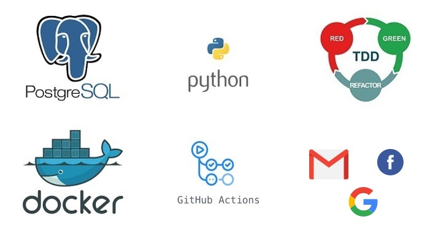

# Bike Zone Project

## Summary

Bike Zone is a web application that serves as an online shop for second-hand motorbikes. 
It leverages a wide range of technologies, including Python, Django, Docker, TDD, GitHub Actions, 
and PostgreSQL, to deliver a robust and feature-rich platform.

Key features of the project include handling database race conditions through the implementation 
of the wait_for_db.py command, ensuring seamless image handling capabilities, and managing permissions 
for static files. Additionally, to enhance security, the application runs under a different user than root.

The frontend of the application is built using Django templates, providing a consistent and 
user-friendly interface with a base template, top bar, dynamic navbar, dynamic titles, and footer. 
The implementation of the Django multiselect field enhances the text editing experience for users.

To facilitate data population, a command is available to autopopulate the Bike model with realistic 
data and sample generated images. The inclusion of search functionality allows users to easily 
find specific information within the application. The integration of the humanize library enhances 
data visualization for improved user experience.

The project goes beyond standard configurations by customizing the admin interface and Django 
authentication for seamless logins, sign-ins, and logouts. Messages are incorporated using Django's 
messaging framework to provide informative and interactive notifications.

Overall, Bike Zone is a comprehensive web application that combines cutting-edge technologies 
and thoughtful features to create a seamless online shopping experience for second-hand motorbikes.


## Technologies



## Gmail API Integration

Integrated the Gmail API to enable the application to send email messages.
Instructions for configuring the Gmail API can be found here: 
https://www.youtube.com/watch?v=sCsMfLf1MTg

## Dashboard Page

Implemented a dashboard page that allows users to view their inquiries and relevant information.

## Social Media Login

Integrated login functionality with Facebook and Google accounts.
Please note that additional instructions are required to connect the Django login system with 
Facebook and Google. The demo API settings are not included in the project.


## Getting Started
To run this project locally, follow the steps below:

Clone the repository:
```GitBash
git clone <repository_url>
```
# Configure the project:

Locate the config_template.py file in the app directory.
Rename it to config.py.
Fill in the correct data for the configuration variables specified in the file.
Update the settings.py file locate din folder app > app > :
Replace this code:
```
# SECURITY WARNING: keep the secret key used in production secret!
try:
    from .config import *
except ImportError:
    SECRET_KEY = 'django-insecure
```
with
```
# SECURITY WARNING: keep the secret key used in production secret!
SECRET_KEY = 'django-insecure
```


## Install Docker:

Docker is required to run the application and its dependencies in a containerized environment.
Follow the instructions provided by Docker to install it on your operating system: Docker 
Installation Guide.
https://docs.docker.com/get-docker/

# Build and Run the Application:
Open your terminal and navigate to the project directory.
Run the following command to build the Docker images:
```GitBash
docker-compose build
```

Once the build process is complete, start the containers using the following command:
```GitBash
docker-compose up
```
The application will now be running locally on localhost:8000.

## Create a Superuser:

To create a superuser account, open a new terminal and navigate to the project directory.
Run the following command:
```GitBash
docker-compose run app sh -c "python manage.py createsuperuser"
```
Follow the prompts to enter the necessary information for the superuser account.

## Access the Application:
Open your web browser and visit localhost:8000 to access the application.
Use the superuser credentials to log in and explore the admin interface and other functionalities.


## Testing
This project follows best practice principles such as TDD, ensuring that all features are 
tested thoroughly before being released. To run the tests, use the following command:

```GitBash
docker-compose run app sh -c "python manage.py test"
```

This command will run the Django Test Framework to run all the tests.

## Continuous Integration
This project is configured to use GitHub Actions to automate linting and unit testing. 
When a pull request is created, GitHub Actions will automatically run the tests and code 
checks to ensure that the code is up to standard.
